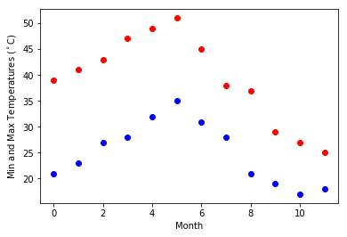
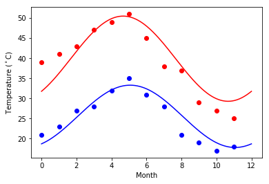
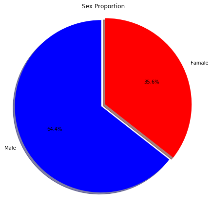
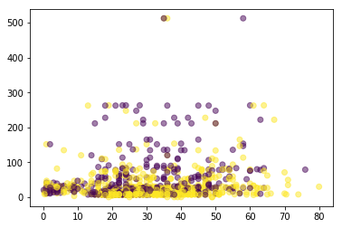

```python
import matplotlib.pyplot as plt
```


```python
%matplotlib inline
```


```python
Task:
1. fitting it to the periodic function
2. plot the fit
```


```python
import numpy as np
```


```python
Temp_Max =np.array([39, 41, 43, 47, 49, 51, 45, 38, 37, 29, 27, 25])
Temp_Min =np.array([21, 23, 27, 28, 32, 35, 31, 28, 21, 19, 17, 18])
```


```python
Temp_Max
Temp_Min
```


    array([21, 23, 27, 28, 32, 35, 31, 28, 21, 19, 17, 18])


```python
months=np.arange(12)
plt.plot(months,Temp_Max,'ro')
plt.plot(months,Temp_Min,'bo')
plt.xlabel('Month')
plt.ylabel('Min and Max Temperatures ($^\circ$C)')
```


    Text(0,0.5,'Min and Max Temperatures ($^\\circ$C)')





```python
from scipy import optimize
def yearly_temps(times,avg,ampl,time_offset):
    return (avg+ampl*np.cos((times+time_offset)*2*np.pi/times.max()))
res_max,cov_max=optimize.curve_fit(yearly_temps,months,Temp_Max,[20,10,0])
res_min,cov_min=optimize.curve_fit(yearly_temps,months,Temp_Min,[-40,20,0])
```


```python
days=np.linspace(0,12,num=365)
plt.figure()
plt.plot(months,Temp_Max,'ro')
plt.plot(days,yearly_temps(days,*res_max),'r-')
plt.plot(months,Temp_Min,'bo')
plt.plot(days,yearly_temps(days,*res_min),'b-')
plt.xlabel('Month')
plt.ylabel('Temperature ($^\circ$C)')
plt.show()
```





```python
import pandas as pd
```


```python
titanic = pd.read_csv('https://raw.githubusercontent.com/Geoyi/Cleaning-Titanic-Data/master/titanic_original.csv')
```


```python
titanic.head()
```


<div>
<style scoped>
    .dataframe tbody tr th:only-of-type {
        vertical-align: middle;
    }

    .dataframe tbody tr th {
        vertical-align: top;
    }

    .dataframe thead th {
        text-align: right;
    }
</style>
<table border="1" class="dataframe">
  <thead>
    <tr style="text-align: right;">
      <th></th>
      <th>pclass</th>
      <th>survived</th>
      <th>name</th>
      <th>sex</th>
      <th>age</th>
      <th>sibsp</th>
      <th>parch</th>
      <th>ticket</th>
      <th>fare</th>
      <th>cabin</th>
      <th>embarked</th>
      <th>boat</th>
      <th>body</th>
      <th>home.dest</th>
    </tr>
  </thead>
  <tbody>
    <tr>
      <th>0</th>
      <td>1.0</td>
      <td>1.0</td>
      <td>Allen, Miss. Elisabeth Walton</td>
      <td>female</td>
      <td>29.0000</td>
      <td>0.0</td>
      <td>0.0</td>
      <td>24160</td>
      <td>211.3375</td>
      <td>B5</td>
      <td>S</td>
      <td>2</td>
      <td>NaN</td>
      <td>St Louis, MO</td>
    </tr>
    <tr>
      <th>1</th>
      <td>1.0</td>
      <td>1.0</td>
      <td>Allison, Master. Hudson Trevor</td>
      <td>male</td>
      <td>0.9167</td>
      <td>1.0</td>
      <td>2.0</td>
      <td>113781</td>
      <td>151.5500</td>
      <td>C22 C26</td>
      <td>S</td>
      <td>11</td>
      <td>NaN</td>
      <td>Montreal, PQ / Chesterville, ON</td>
    </tr>
    <tr>
      <th>2</th>
      <td>1.0</td>
      <td>0.0</td>
      <td>Allison, Miss. Helen Loraine</td>
      <td>female</td>
      <td>2.0000</td>
      <td>1.0</td>
      <td>2.0</td>
      <td>113781</td>
      <td>151.5500</td>
      <td>C22 C26</td>
      <td>S</td>
      <td>NaN</td>
      <td>NaN</td>
      <td>Montreal, PQ / Chesterville, ON</td>
    </tr>
    <tr>
      <th>3</th>
      <td>1.0</td>
      <td>0.0</td>
      <td>Allison, Mr. Hudson Joshua Creighton</td>
      <td>male</td>
      <td>30.0000</td>
      <td>1.0</td>
      <td>2.0</td>
      <td>113781</td>
      <td>151.5500</td>
      <td>C22 C26</td>
      <td>S</td>
      <td>NaN</td>
      <td>135.0</td>
      <td>Montreal, PQ / Chesterville, ON</td>
    </tr>
    <tr>
      <th>4</th>
      <td>1.0</td>
      <td>0.0</td>
      <td>Allison, Mrs. Hudson J C (Bessie Waldo Daniels)</td>
      <td>female</td>
      <td>25.0000</td>
      <td>1.0</td>
      <td>2.0</td>
      <td>113781</td>
      <td>151.5500</td>
      <td>C22 C26</td>
      <td>S</td>
      <td>NaN</td>
      <td>NaN</td>
      <td>Montreal, PQ / Chesterville, ON</td>
    </tr>
  </tbody>
</table>
</div>


2.Create a pie chart presenting the male/female proportion


```python
    female_count = titanic.groupby(by="sex").size().female
    male_count = titanic.groupby(by="sex").size().male
    plt.figure(1, figsize=(6,6))
    labels = ["Male", "Famale"]
    sizes = [male_count, female_count]
    colors = ['blue', 'red']
    explode=(0, 0.05)
    plt.pie(sizes, labels=labels, colors=colors,autopct='%1.1f%%', shadow=True, startangle=90, explode=explode)
    plt.title('Sex Proportion')
    #plt.legend(patches, labels, loc="best")
    plt.axis('equal')
    plt.tight_layout()
    plt.show()


```





3.Create a scatterplot with the Fare paid and the Age, differ the plot color by gender


```python
plt.scatter(titanic['age'], titanic['fare'], alpha=0.5, c=pd.factorize(titanic['sex'])[0])
```


    <matplotlib.collections.PathCollection at 0x1794e13c9b0>





```python

```
